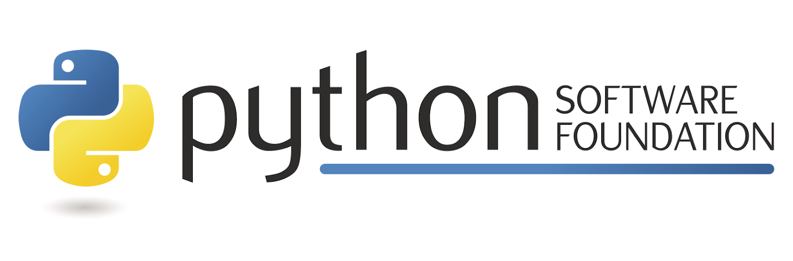

<!-- #! code_of_conduct_template.md

  document-meta:
    - version: 1.0
    - status:  complete
    - updated: 26/10/2025
    - authors: Nathan Bransby <open-source@nlb-software.dev>
-->

  

# Community Code of Conduct Template
> ***A Code of Conduct template that local Python organizers can use and adjust for their communities, events, activities.***

---

*This document contains an adaptable Code of Conduct template that Python communities and organizers can use for their events and meetups.*
*Anyone is welcome to download and adjust this document to suit their needs.*

*— a markdown version of this template and other community policies & procedures are available on [GitHub](https://github.com/Nathan-Bransby-NMT/python-community-docs/) if you wish to fork and make adjustments for your communities.*

---

## Table of Contents

1. [Purpose](#purpose)  
2. [Scope](#scope)  
3. [Community Standards](#community-standards)  
   1. [Anti-Harassment Policy](#anti-harassment-policy)  
   2. [Ableism & Accessibility Policy](#ableism--accessibility-policy)  
   3. [Anti-Sexism Policy](#anti-sexism-policy)  
   4. [Expected Behavior](#expected-behavior)
4. [Reporting Guidelines](#reporting-guidelines)  
   1. [Anonymous Reports](#anonymous-reports)  
   2. [Reports Involving Organizers](#reports-involving-organizers)  
   3. [Support & Emergency Services](#support--emergency-services)
5. [Enforcement](#enforcement)  
   1. [Enforcement Procedure](#enforcement-procedure)  
      1. [*Receipt of Report*](#receipt-of-report)  
      2. [*Initial Assessment*](#initial-assessment)  
      3. [*Deliberation*](#deliberation)  
      4. [*Decision & Taking Action*](#decision--taking-action)  
      5. [*Communication & Closing*](#communication--closing)
   2. [Appeal Process](#appeal-process)

---

1. ## Purpose 

Our community is committed to the provision of a welcoming and harassment-free experience for all participants, regardless of gender, gender identity and expression, sexual orientation, disability, physical appearance, body size, race, age, religion, or any other personal characteristic. 

The use of, or support of harassment in any form will not be tolerated. Sexual language, behavior and imagery is deemed inappropriate in any context associated with this event or community. Any unconsenting physical contact or disrespect of others privacy is to be respected. Individuals found violating these guidelines may be subject to sanctions or expulsion from the event or community, at the sole discretion of the organising body *(and/or)* Code of Conduct committee, without entitlement to a refund.

2. ## Scope

This Code of Conduct applies to all event spaces — both physical and online, or in any engagement/interaction within the community. This includes but is not limited to: talks, workshops, community spaces, social media, any form of communication, planning, organizing, and collaborating.

This Code will be upheld and enforced by all participating members involved in the planning, operation, and engagement within the community.  

3. ## Community Standards

   1. ### Anti-Harassment Policy 

   We are committed and responsible to protecting members of our community. Any form of harassment is simply inexcusable and not tolerated in the community.

   Harassment includes, but is not limited to:

   - *Verbal or written comments that reinforce social hierarchies related to gender, gender identity and expression, sexual orientation, disability, physical appearance, body size, race, age, or religion.*
  - *Display of sexual images in public spaces.*
  - *Deliberate intimidation, stalking, or following.*
  - *Harassing photography or recording.*
  - *Sustained disruption of talks or events.*
  - *Inappropriate or unwanted physical contact.*
  - *Unwelcome sexual attention.*
  - *Advocacy for or encouragement of any prohibited behaviors described above.*
   

   2. ### Ableism & Accessibility Policy

   We aim to provide an equal experience and accessibility for anyone who may require extra support. We encourage a safe and welcoming space to all members of the community. 

   We condemn any form of ableism or ableist language whether intentional or unintentional. Ableist language includes using language such as “crazy”, “dumb”, “insane”, and “lame”. We encourage the use of more respectful alternatives instead.

 > [!TIP]
 > *You can learn more about ableism and replacement terms in [this guide](https://www.autistichoya.com/p/ableist-words-and-terms-to-avoid.html).*
 >

   3. ### Anti-Sexism Policy 

   Sexism in any form is strictly prohibited within our community and at our events. All participants are expected to use gender-inclusive language and refrain from any behavior, remarks, or actions that perpetuate gender stereotypes or marginalize individuals based on gender identity or expression.

 > [!TIP]
 > *For more about what is and isn’t acceptable language, familiarise yourself with the [Geek Feminism wiki](http://geekfeminism.wikia.com/wiki/Nonsexist_language).*
 >

   4. ### Expected Behavior 

   Everyone is expected to contribute to a respectful, safe, and welcoming environment by upholding good behavior that helps create a safe, positive and inclusive environment at all times.

   Examples of positive behaviour include:

  - *Being open: Actively collaborate with others regardless of background, and encourage a diversity of perspectives.*  
  - *Being considerate: Acknowledge and appreciate the contributions of fellow community members, volunteers, and organisers.*  
  - *Being respectful: Listen to differing viewpoints, accept constructive criticism gracefully, and address any disagreements politely.*  
  - *Demonstrating empathy: Show patience, understanding, and kindness to all participants.*  
  - *Using welcoming and inclusive language: Avoid exclusionary jokes, slurs, or stereotypes; strive for language and actions that foster belonging.*

4. ## Reporting Guidelines 

Reports can be made physically in person or online by using the appropriate channels or means of communication. All reports will be investigated and dealt with by organizers and officially appointed members of the community. 

If yourself, or you notice someone else feeling unsafe or unwelcome or you witness behaviour that does not align with any of our standards, please notify event organisers or community leaders at the earliest opportunity. 

You can make anonymous and personal reports by visiting: \[ SELF-REPORT LINK \]. All concerns will be addressed discreetly and respectfully. Organisers *(and/or)* Code of Conduct staff will be clearly identified in-person and online. Where possible, training will be provided to those dealing with reports and will respect the privacy of those involved when dealing with a response.

   1. ### Anonymous Reports 

   Anonymous reports can be submitted via the official channel provided. While direct follow-up may not be possible, all reports will be investigated thoroughly, and appropriate action will be pursued where deemed necessary.
   

   2. ### Reports Involving Organizers 

   If the report involves one of the organisers, then you can submit a Code of Conduct report to our third-party Code of Conduct representative that is external to the event organisers: \[ EXTERNAL REPRESENTATIVE EMAIL \].

   3. ### Support & Emergency Services 

   The wellbeing of members in the community is our highest priority. In any circumstance where any individual’s immediate health, safety, or wellbeing is at risk, community members and event staff are expected to act promptly and responsibly.

   

   You should contact local emergency services (police, ambulance, or fire) without delay in the following situations:

   - *There is a credible threat of violence, harm, or imminent danger to any person*
   - *Someone is experiencing a medical emergency requiring urgent professional assistance*
   - *You witness or are informed of any form of physical (and/or) sexual assault, or any other form of violence or threatening nature*
   - *Situations involving loss of consciousness, severe injury, or medical distress that cannot be safely managed by onsite staff*
   

   > [!NOTE] 
   > *You should include the phone numbers here to local emergency and non-emergency services, and perhaps include links and phone numbers to mental health services in the case where someone happens to witness or experience something traumatic.*

5. ## Enforcement   

   1. ### Enforcement Procedure 

   Community organisers (and/or) designated Code of Conduct representatives are responsible for the fair and consistent enforcement of this Code of Conduct. Once a report is received, the following procedure will be followed.

      1. #### Receipt of Report 

      When a report of potential Code of Conduct (CoC) violation is received, it should be promptly acknowledged by a designated responder. All reporters will be assured that their concerns are taken seriously and treated with confidentiality. The responder will clarify next steps and request any additional information needed for a fair and thorough investigation, while prioritizing the privacy and well-being of those involved.

		
      2. #### Initial Assessment

      Upon receipt, the CoC team will assess whether the reported issue falls within the scope of the Code of Conduct. This may involve gathering more context from all parties or witnesses while giving reassurance about confidentiality. The initial assessment focuses on understanding the facts, identifying any immediate risk, and determining whether interim measures are needed to protect community members.

      
      3. #### Deliberation 
	  
      The CoC team will review all available information before making a judgment. All deliberations are guided by principles of impartiality and fairness including evaluating intent, impact, potential harm, history, and recurrence. Any team member with a conflict of interest will recuse themselves from the process. The priority is to uphold community safety and inclusivity.

	  4. #### Decision & Taking Action

	  Based on their findings, the CoC team will determine the most appropriate corrective action. This may include a confidential warning, required apology, temporary or permanent removal from events or platforms, or other proportionate remedies. Decisions take into account the severity of the breach, past behaviour, and potential for harm, always seeking a resolution that protects community integrity.

	  5. #### Communication & Closing 

      Once a decision is reached, all involved parties will be informed of the outcome in a timely, respectful manner. The rationale for the decision and any actions taken will be clearly communicated. Records of the report and response will be kept securely and confidentially, ensuring accountability while protecting privacy. Where appropriate, the team will offer pathways for appeal or follow-up support.

   2. ### Appeal Process 

   If an individual believes a decision or action was made in error, an appeal may be submitted to an external Code of Conduct representative (if applicable) for review. The outcome of the appeal will be considered final.

   *Our aim is a process that is prompt, consistent, confidential, and fair, prioritising the safety and dignity of all community members.*

